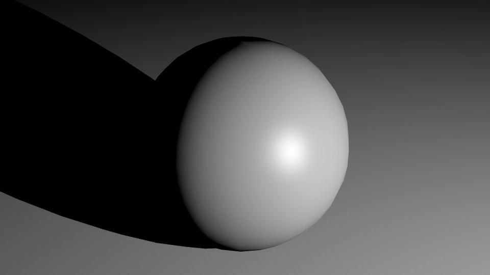
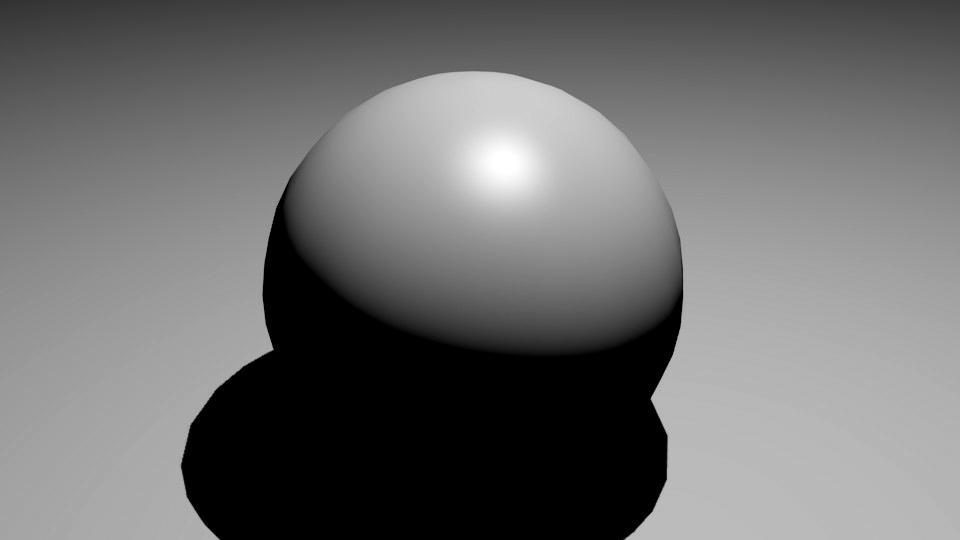
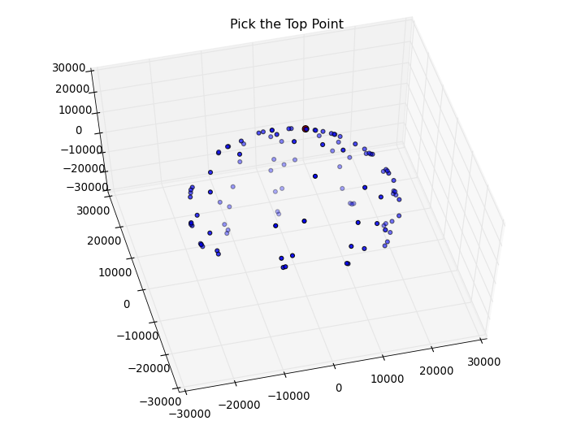
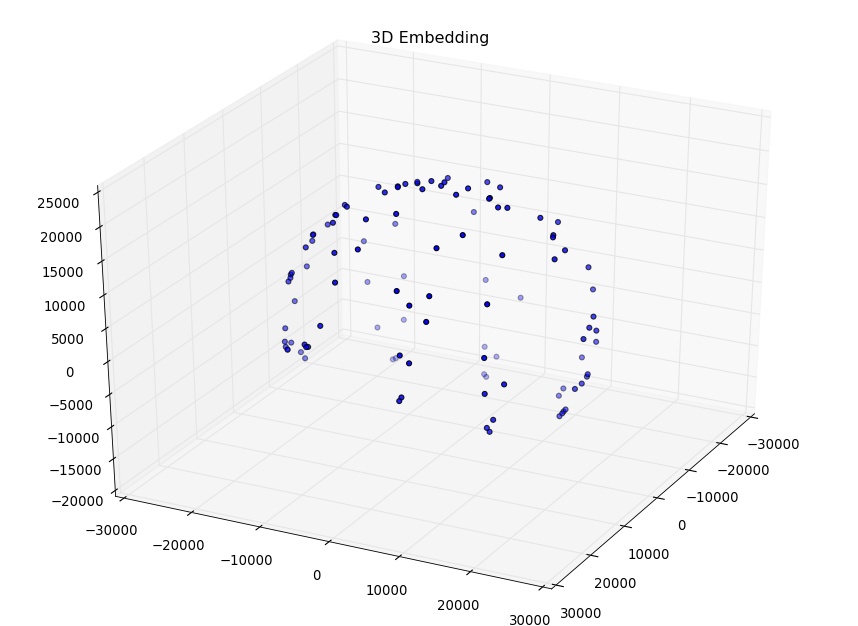
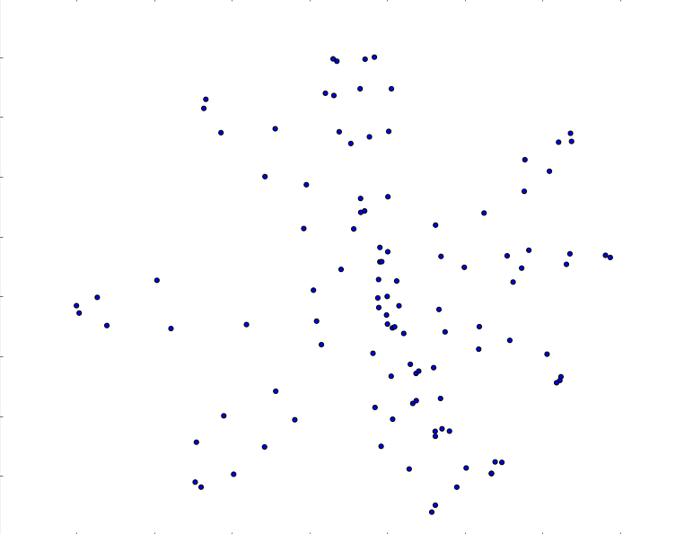

# Light Waving
### Relighting Images
- Menu Interface
- Isomap and Multi-dimensional Scaling
- Delaunay Triangulations

Please see <a src="http://www.crispinbernier.me/reLweb/reLight.php">http://www.crispinbernier.me/reLweb/reLight.php</a> for an online demo of the final output.

####Instructions
1. Run reLight.py with <code>$ python reLight.py</code>. Testing was done with python 2.7 with scipy and tkinter.
2. tk window should pop up. Choose 'Read a directory of images' and the default settings should run through an example data set. (The 'Read from CSV file' option is only used for performing Isomap embeddings on CSV files of coordinate vectors and not for doing light waving interpolations.)
3. After picking the top point of the embedded sphere click the 'accept coordinates' button in the seperate window.
4. The interpolated image may not appear until a coordinate on the blue canvas is selected

###Images of the Process
Some examples of input images
 
 
 

 
Visualization of the image vectors embedded into 3 dimensions using Isomap
 

 
3D embedding fitted to sphere using least squares fitting
 

 
3D sphere "unrolled" into 2 dimensions
 

 
Demonstration of final output of the desktop application.
<video width="400" height="200" controls> <source src="recording.mp4" type="video/mp4">
	Your browser does not support the video tag.</video>
 

####Notes
- For doing MDS on a CSV file each row should be a sample and each collumn should be a dimension.
- The bottleneck of this algorithm is doing floyds algorithm over N sample image vectors.
- The test sets were made in Blender.

####Descriptions of some Menu Buttons.

Raw 3D Embedding: Embedding of the data into 3 dimensions using classic multi-dimensional scaling.

Fit 3D Embedding: The Raw 3D embedding is then fit to a sphere using least squares regression and the data is projected onto the sphere. This is also shown when the user selects the point to unwrap the data from.

Unrolled Embedding: This is also displayed on the blue panel in the final menu After projecting the data onto a sphere it is unwrapped into 2 dimensions.

w/Neighbors: Shows the neighbor relations between data points at a particular step. Neighbors are connected with a line and data points have approximately k neighbors with k being a user input. w/Neighbors generally takes a longer time for pyplot to display and is slower to manipulate then the other visualizations.

Save: Saves a csv file in the same directory with the unrolled embedding.

Flip: Flips the points on the control panel vertically

Writeup
<a src="http://www.crispinbernier.me/reLweb/light-waving-report.pdf">http://www.crispinbernier.me/reLweb/light-waving-report.pdf</a>